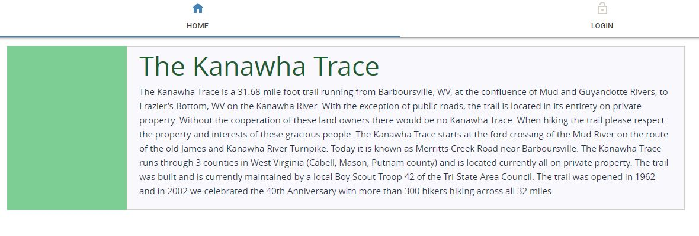
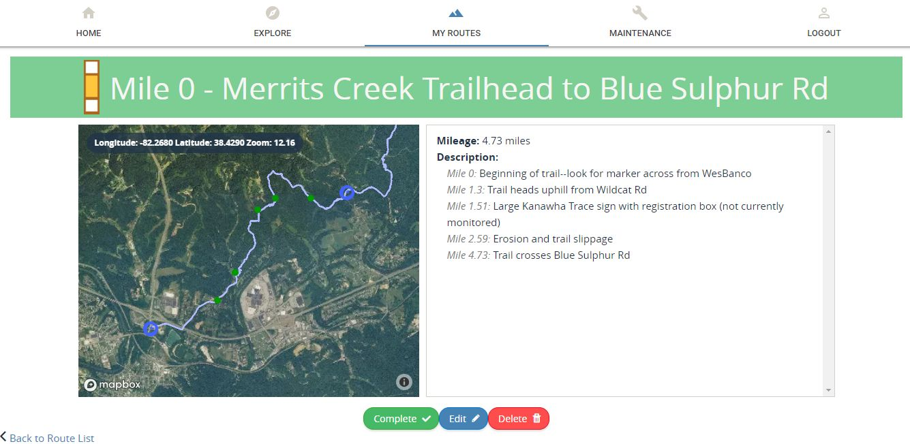
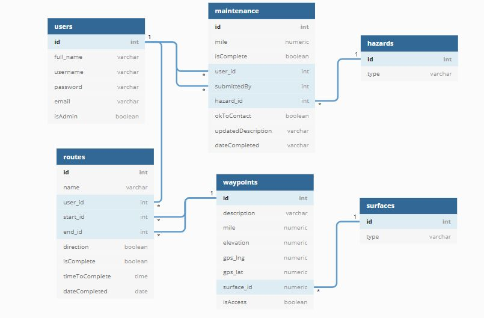

# Welcome to the Kanawha Trace Trail Guide

The Kanawha Trace Trail (also known as The KT Trail) is an approximately 32-mile trail that runs from Barboursville to Fraziers Bottom in West Virginia.  The Kanawha Trace Trail guide is a web-based application that allows users of the KT Trail to plan routes, record dates and times of routes they have completed, and submit maintenance requests.  The purpose of this application is to provide current and updated information about the status of the trail, and allow users to plan and navigate with tools that are easier to understand than paper-based topographical maps.  A secondary purpose is to improve the visibility of the trail and encourage new and existing users to venture out more often.

The target users are trail-runners, hikers, mountain-bikers and backpackers who are interested in learning more about the features and technical aspects of the KT trail.

See the application online at https://kanawha-trace.herokuapp.com

## HOME



Users begin their experience with the Home Page, which gives them a little background and history of the Kanawha Trace.  From here, they must log-in or register to utilize all the features of this application.

## EXPLORE

When a user logs in, they can view the Explore page to see a map of the entire KT with blue markers showing access points.  Clicking on the markers will show a popup on the map that gives details about the point, such as the name and mile point.  The user may also zoom and pan the map with their mouse, as desired.

Using the dropdowns on the left, users can select a start and end point for their route.  Once both are selected, they can hit 'submit' and the route will be created.


Two links will appear below the submit button that allow the user to go directly to the details of the newly created route, or navigate to a page to view all of their routes.

## ROUTES

Routes on the 'Routes' page are separated into two categories--planned and completed.  Newly created routes will show up in the planned column.  The route card includes the name of the route (based on the start and end points) and a trail marker which shows the direction of travel on the trail and corresponds to the trail markings that a user would see on trees and signs on the actual KT trail. White-yellow-white indicates they are traveling north-east (in the direction of increasing mile markers), and yellow-white-yellow indicates they are traveling south-west (in the direction of decreasing mile markers).

### Reversing Routes


Users may click on the affordance to change the direction of the route. The name and trail marker will update accordingly.

### Completing Routes


Users may click on the 'complete' button if they want to mark a route as completed.  A form will pop up that allows them to submit the date they completed the route as well as how long it took them to complete (in the time format hh:mm:ss).


### Route Details

From the 'Routes' page, users can click on the 'details' button of any of the routes to go to a page with more information about that route.  A map will populate the left side of the page with a zoomed-in view of that section of trail defined by the selected start and end points.  There will also be a descriptive list in the right-hand column which gives details about the total mileage (and the date and time completed for completed routes) as well as features and hazards to look for along the route.  The corresponding waypoints for these features and hazards are also shown on the map.


Clicking on any of the green dots between the start and end points on the map will show a popup with the name of the waypoint and the mileage. The user can also zoom and pan the map with their mouse, as desired.  Refreshing the page will return the map to the original view.

### Editing Routes


Users may click on the 'edit' button to change the start and end points of the route.  A form will pop up with dropdown-selects to allow them to make this change.  Clicking submit will update the route on their page.

Once a route is marked as complete, the user may edit the date and time of that route, but may no longer edit the start and end points.

### Deleting Routes
A user can delete a route from either the 'Routes' page or the details view.  A dialog will pop up asking them to confirm before deleting the route.


## MAINTENANCE
Another feature of this application allows users to submit reports of issues on the trail that require maintenance or other interventions.  From the 'Maintenance' tab, users can see ongoing requests (sorted by mile) or submit one of their own.  There is an affordance to allow the user to be contacted about the request should further information be required.


### Administrator View
If the user logs in with administrative credentials, the admin view looks a little different.  They not only have the ability to create a maintenance request, but they can assign the request to themselves or others, add additional details, mark the request as "complete", or delete maintenance requests.

### Maintenance Details

Clicking on the name of the request will allow the admin user to view more details about the request, such as when it was submitted or to whom it is assigned.  Clicking on the 'edit' button will allow the admin user to make clarifications to the description or assign the task to another admin.  Clicking on the 'complete' button will allow the admin user to mark the task as 'complete' and provide a description of what work was done.  The task may also be marked as complete from the 'Maintenance' page by clicking on the empty checkbox next to the task.  This activates a form that allows the user to submit the date completed and any pertinent details or recommendations for this maintenance task.  Maintenance items can also be deleted by administrators from the details view.  A dialog will pop up asking the admin user to confirm the delete request before processing it.


## TECHNICAL NOTES

This project was bootstrapped with [Create React App](https://github.com/facebook/create-react-app).

### Using this APP

Fork the directory from https://github.com/sydneywait/Kanawaha-Trace to your own local repository.

You will need to install the following to run the program locally:

```
npm install
npm install --save moment react-moment
npm install @material-ui/icons
npm install @material-ui/core
npm install primereact --save
npm install primeicons --save
npm install mapbox-gl
```

Additionally, you will need to obtain an API key from mapbox, and an auth key from AuthO.  These will need to be inserted into files
```~/src/components/authentication/APITokens.js```
and
```~/src/components/authentication/AuthConfig.js```
Examples are given in the authentication directory on which to base your file.

Copy the boilerplate code from
```~/api/boilerplate.json ```
to a file called
```~/api/database.json  ```

In the project directory, you can run:

```npm start```

Which runs the app in the development mode.<br>
Open [http://localhost:3000](http://localhost:3000) to view it in the browser.
The page will reload if you make edits.<br>
You will also see any lint errors in the console.

You must also run the following command in a separate command prompt to initiate the database
```json-server -p 5002 -w api/database.json```

### ERD Diagram
The following is an entity relationship diagram for the database



## Author
This module was built by Sydney Wait --see more on [Github](https://github.com/sydneywait)

## Acknowledgements
I would like to acknowledge Chris Kyle and Robert Wilson for their help in mapping the trail and use of the Kanawha Trace Guidebook.

Additionally I would like to recognize the volunteer organization [Friends of the Kanawha Trace](https://www.facebook.com/TheKanawhaTrace/) for their tireless efforts to support, maintain, and publicize the trail.  Many of the waypoints and features described come from the Kanawha Trace Guidebook or personal experience of runners and other trail users, such as those in the [Kanawha Trace Trail Running Club](https://www.facebook.com/groups/483374695008119/).

Lastly, none of the skills used to create this application would be possible without the wisdom, experience and guidance provided by Jordan Castelloe, Kim Preece, and Josh Joseph of [NewForce](https://newforce.co/), and the amazing folks at [Generation West Virginia](https://generationwv.org/about/) and [Mountwest Community and Technical College](http://www.mctc.edu/).


